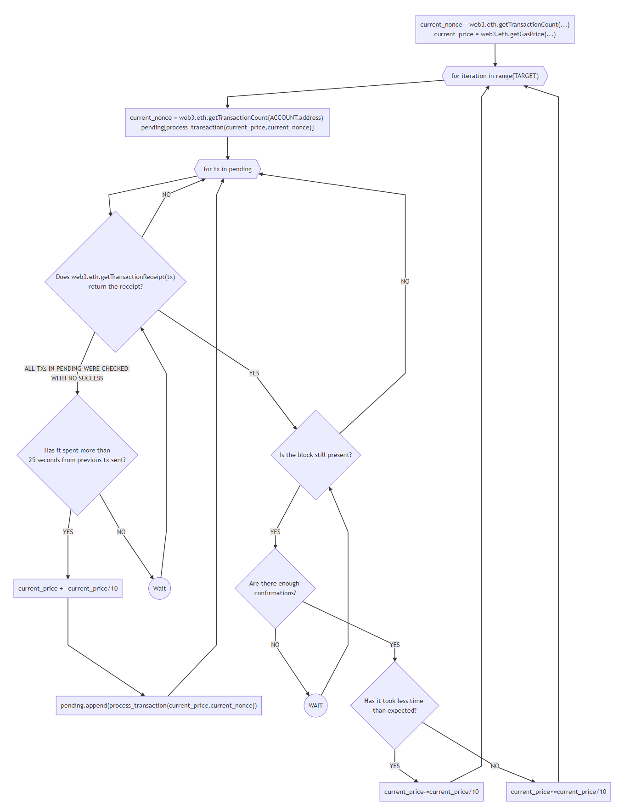
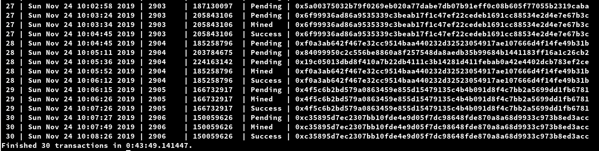

[](https://travis-ci.com/darkost12/CounterReworked)

# CounterReworked

## Abstract
The app based on [*CounterSolidity*](github.com/darkost12/CounterSolidity) project. This is used to demonstrate the automated transactions with the lowest possible price.
Base contract should be deployed in the network. The script's directive is to achieve **TARGET** (see [*Configuration*](github.com/darkost12/CounterReworked#Configuration)) transactions in **TARGET_TIME** seconds with minimal gas price.

## Installation
```bash
Base contract and tests
git clone github.com/darkost12/CounterSolidity.git

CounterReworked application
git clone github.com/darkost12/CounterReworked.git

Use Pipenv to run the application.
pipenv install
```

## Configuration
Set your preferences in environment variable.

| Variable | Description |
| --- | --- |
| **RPC** | your RPC-token, e.g. Infura (https:// should be present) |
| **PRIV_KEY** | your private key |
| **CONFIRMATIONS** | number of blocks placed after one that contains our transaction |
| **TARGET** | desired amount of transactions |
| **TARGET_TIME** | amount of time in seconds assigned to **TARGET** |
| **ADDRESS** | address of deployed contract |

## Usage
* Deploy your CounterSolidity contract anywhere you want and get the address;
* Specify environment variables;
* Finally run the script using:
```bash
pipenv install
pipenv run python counter_reworked.py
```
This can take some time.

## Logic
Available **TARGET_TIME** is divided by **TARGET** to get the approximate time interval for one transaction (target_ratio).

First of all, script gets the current gas price and divides this number to get the starting value for its work. Application sends to contract the transaction with the request to increment the counter with that small gas price.

After some halt the script checks whether the transaction has got into the block or not. If so, the script waits for enough **CONFIRMATIONS** to step forward.

*If it can't succeed in some period of time, the minimal price should be increased.
If this process was finished in a shorter time than TARGET_TIME/TARGET,
the gas price could be dropped.*

Thus we get the algorithm that reaches the lowest expenditures while dealing with fluctuating prices. All the process is continuous.

The script writes it's decisions on gas price and other information in console is fixed format.

## Structure
The application consists of two modules: *config.py* and *counter_reworked.py*.
**counter_reworked.py** is the main module of this application. The logic of price manipulations, forming and sending of transactions, checking for confirmations and other functions are implemented here.
**config.py** is used to set up the configuration of user and transfer it to the main module. It also establishes the web3 provider and creates the instance of desired smart contract.

## Tests and CI
*This paragraph is under construction.*

## Log format
The application writes its log in console with following order of variables:
* iteration number;
* current time;
* nonce, with which the program works in this iteration;
* current gas price;
* status / type of event;
* transaction hash.

There are following statuses:
* **Pending** - transaction was sent and added to pending[];
* **Mined** - transaction with that hash was mined, and now it's going to wait for its confirmation;
* **Success** - required amount of confirmations was achieved, after that the program switches to next iteration.

**Header** - service status, used to print the header of the log once in some period of time.

## Graphic illustrations

### Logic representation


### Example of log and result (tested on Ropsten)

